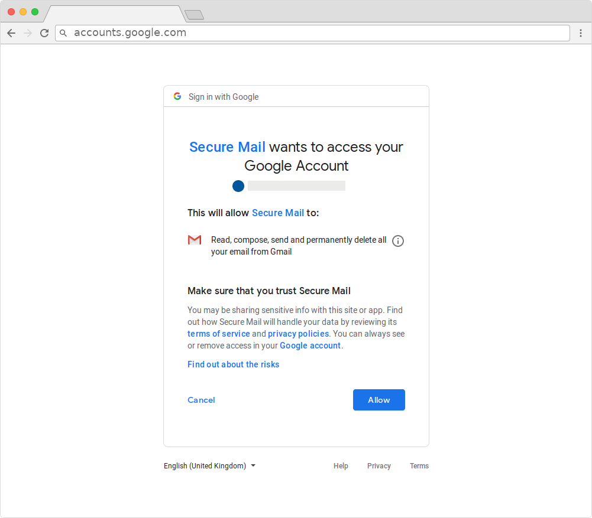

# OAuth Phishing (or Third-Party Application Phishing)

OAuth Phishing is an insidious form of phishing that does not rely on luring a target to a fake clone of a legitimate site, but rather on abusing an existing feature most online services provide. Google, Yahoo and others, for example, allow their users to connect their account to a third-party app that can be granted privileges to read the content of their email inboxes and more. For example, a legitimate third-party app could leverage this to allow users to import flight bookings or other reservations from their email inbox to a separate calendar application. You can read more about this functionality [here](https://support.google.com/accounts/answer/3466521).

Attackers have been abusing this feature by creating malicious third-party apps that are masqueraded as legitimate (and generally directly offered by the service provider) and tricking the targets into allowing the application access to their accounts. While with this form of phishing the attackers do not actually obtain the password to the account, the effect remains the same, because by getting granted the right privileges, they are able to read the emails of the victims anyway through the third-party app.

Following is a screenshot of a malicious third-party app called "*Secure Mail*" requesting access to a victim's Gmail account.

  
*Image from [Amnesty International](https://www.amnesty.org/en/latest/research/2019/03/phishing-attacks-using-third-party-applications-against-egyptian-civil-society-organizations/)*

While normally users are warned by Google and others when they are about to grant access to a third-party application, OAuth Phishing is a much lesser known tactic and can be quite deceitful. Additionally, because the authentication to the account happens through the legitimate service, traditional anti-phishing mitigations (such as those we will explain later in this text) do not provide any advantage here.
