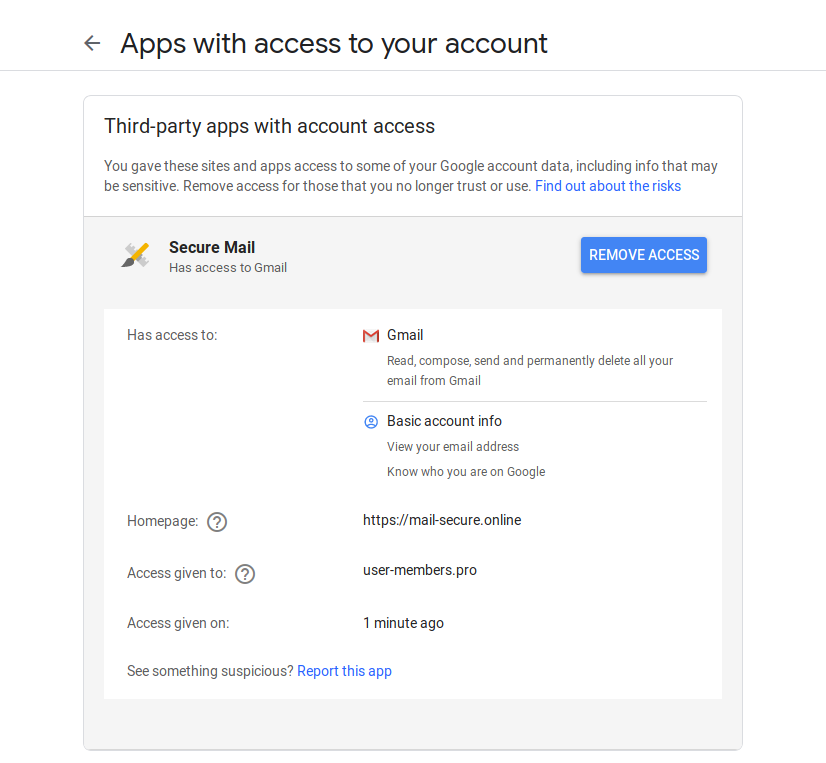

# Review your Accounts

Occasionally it is a good practice to review the privacy & security settings or any suspicious activity on your accounts.

On Google you can visit the [Privacy Checkup](https://myaccount.google.com/privacycheckup) and [Security Checkup](https://myaccount.google.com/security-checkup) pages. These pages would normally highlight any misconfigurations or any suspicious events.

For example, it might highlight malicious third-party applications!

*Screenshot by [Amnesty International](https://www.amnesty.org/en/latest/research/2019/03/phishing-attacks-using-third-party-applications-against-egyptian-civil-society-organizations/)*

You might also find devices connected to your accounts that you do not recognize, or that you have not been using in a long time. A more comprehensive list of security settings for your Google account to review can be found [here](https://myaccount.google.com/security). We recommend you give it a thorough read.

Facebook offers a similar security checkup at [this page](https://www.facebook.com/security/checkup/?source=help_center).
