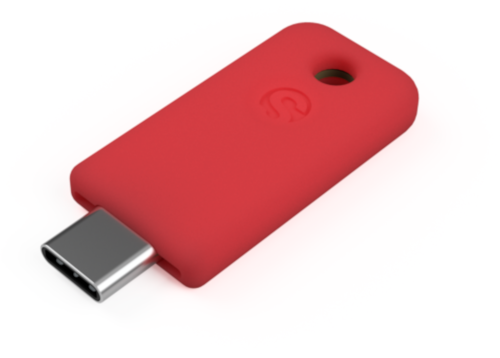

# Security keys

Currently, security keys are the most secure form of two-factor authentication. Security keys are hardware tokens that implement what is known as the [U2F protocol](https://en.wikipedia.org/wiki/Universal_2nd_Factor) and they generally come in the shape of USB keys, although some support other channels such as NFC (mostly to function with mobile devices). When an online account is protected using a security key, the user is required not only to enter their password but to physically insert the security key in the device. This process is nicely visualized in the following animation taken from the [Solo](https://www.kickstarter.com/projects/conorpatrick/solo-the-first-open-source-fido2-security-key-usb) Kickstarter campaign:

While in the case, for example, of SMS verification an attacker could steal the verification code sent to the user, in this case the attacker can only physically steal the security key (as well as obtain the password) in order to log into the target's account. Obviously, this is significantly harder.

## How to pick a Security Key

There are numerous companies producing these security keys, following are some of the most popular options:

- [YubiKey](https://www.yubico.com/product/security-key-by-yubico/)

- [NitroKey](https://www.nitrokey.com/)

- [SoloKeys](https://www.solokeys.com/) (open hardware and open source)

Online shops will most likely offer you various options and variants of these different keys. The two most important characteristics you should pay attention to are:

1. **The key explicitly supports the U2F protocol.** Most security keys do, but you might find other variants that are intended for other uses or protocols.
2. **The key uses a connector supported by your device.** Most keys will come with a standard USB connector (like in the first two pictures, for example). Other variatios are on the market, for example using a [USB-C](https://en.wikipedia.org/wiki/USB_Type-C) connector (like in the last picture above), which is commonly available with most recent laptops and even mobile devices.

## Enabling Security Keys

Service providers generally offer different configurations for secure authentication, and those options can be hard to navigate. Even those services who support security keys will most likely allow for fallback authentication and verification methods to be enabled. For example, they might require you to configure an SMS verification as a fallback verification procedure in case you lose your security key. This is quite common, and it is somewhat necessary for service providers to reduce the likelihood of end users to be permanently locked out from their accounts.

The downside of this configuration is that attackers might trick you into a phishing attack that relies on any of the fallback (and less secure) verification methods that they might be able to bypass. However, once you get accustomed to be authenticating with security keys, whenever you encounter what looks like, for example, a Google login requesting you a verification procedure different from your security key, you should be alert as it might be a phishing attack.

Some services provide hardened plans specifically intended for users at risk. For example, accounts with [Google's Advanced Protection](https://landing.google.com/advancedprotection/) enabled will *only* allow authentication through security keys. If you feel this might be a safer option for you, we invite you to read carefully through its description and guidelines provided by the online service, and make sure you fully understand the benefits as well as the constraints.

## Are there any downsides?

More considerations on two-factor authentication and security keys are available in [this post](https://www.amnesty.org/en/latest/research/2018/12/when-best-practice-is-not-good-enough/) from Amnesty International:

> This technology is supported for example by Google's Advanced Protection program, by Facebook and as of recently by Twitter as well. This process might appear painful at first, but it significantly raises the difficulty for any attacker to be successful, and it isn't quite as burdensome as one might think. Normally, you will be required to use a security key only when you are authenticating for the first time from a new device.

> That said, security keys have downsides as well. Firstly, they are still at a very early stage of adoption: only few services support them and most email clients (such as Thunderbird) are still in the process of developing an integration. Secondly, you can of course lose your security key and be locked out of your accounts. However, you could just in the same way lose the phone you use for other forms of two-factor authentication, and in both cases, you should carefully configure an option for recovery (through printed codes or a secondary key) as instructed by the particular service.
