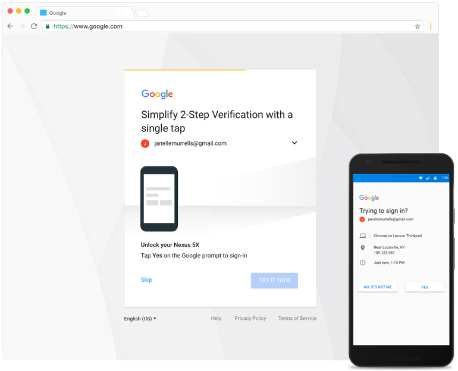

# Two-Factor Verification

An attempted mitigation to phishing has been developed over the years and many (although likely not most) have by now enabled what is commonly referred to as **two-factor verification**, **two-factor verification**, **two-step verification**, etc. The basic idea is quite simple: because passwords can be stolen or guessed, you will be required to perform a secondary verification that should prove your ownership of the account for which a login is being attempted.

Different websites offer implement different flavors of two-factor verification, but most commonly they come in the following forms:

### SMS verification

After having successfully entered your credentials, the service (such as Google, Yahoo, Facebok, or Twitter) will send an SMS message to the phone number you provided upon registration, containing a token (generally numerical or alphanumerical) which you will be required as well to enter in the login page. For example, a Google two-factor verification SMS message would look like this: "*G-857165 is your Google verification code."*

Because SMS messages can be intercepted (for example through wiretapping by the mobile operator, or through [SIM swapping](https://www.vice.com/en_us/article/zm8a9y/how-to-protect-yourself-from-sim-swapping-hacks), SMS verification is by far the weakest form of two-factor verification. Some online services are starting to abandon this verification method, but most are still primarily relying on it. If your service of choice offers other two-factor verification options, you should try to avoid using SMS verification. Nevertheless, it is better than two-factor at all.

### Authenticator apps

When you enable two-factor verification, some services will ask you to install a mobile app on your phone which you will be required to open when attempting a login to fetch a short-lived numerical or alphanumerical token to enter in the login page, very similarly to the previous option. For example, this is what [Google Authenticator](https://google-authenticator.com/) looks like:

*Image from Google*

Better alternatives to Google Authenticator are, for example, [Authy](https://authy.com/) and [Duo Mobile](https://duo.com/product/trusted-users/two-factor-authentication/duo-mobile).

Similarly to SMS verification, whenever logging into your two-factor enabled account, you will be required to open the app and type the ephemeral code in the login prompt. Using authenticator apps is better than using SMS verification, because the codes are not transmitted over a network and therefore can't be intercepted.

### Push notification

When you enable two-factor verification, some services will ask you to install a mobile app which will automatically send you a notification when a login to your account is attempted, and if you wish to authorize it you'd just need to tap a button. For example, Google tends to default its Android users to use this two-factor method through the Google Prompt:

*Image from Google*

The advantage of push notification systems are primarily the convenience of not having to type a numerical code, and secondly the additional information on the attempted login that the app might display. For example, as visible in the screenshot above, a push notification might show the type of device and the geographical location from which the login was attempted. If those details do not appear familiar to you, they might be a good symptom of an ongoing phishing attempt.

---

Without any doubt, these forms of two-factor verification are helpful mitigations that could thwart casual attackers from being able to illegitimately access your accounts. These procedures can be particularly effective against non-targeted phishing attacks (more simply, the kind of attack that would be sent to people en masse through spam emails) and against password reuse (which could be a very real risk considering the [many data breaches](https://www.haveibeenpwned.com) we keep learning about.)

## The fundamental problem with these forms of two-factor

However, **these forms of two-factor verification are not a solution to *all* phishing**. If an attacker is sufficiently resourceful (and many are) they can automate their phishing platform to effectively bypass two-factor verification. Quite simply, if you have fallen for such an attack and have already provided your username and password, the attackers can simply solicit a valid token from you just in the same way, or trick you into permitting the login if you are using a push notification. The attackers would then just have to automatically use the token before it expires, and successfully log into your account.

For example, following is a screenshot of a phishing site soliciting a verification code that was sent via SMS:

This is not hypotethical. We have seen several cases of large-scale targeted phishing campaigns that have employed this technique. For example in the following reports:

- [When Best Practice Isn't Good Enough: Large Campaigns of Phishing Attacks in Middle East and North Africa Target Privacy-Conscious Users](https://www.amnesty.org/en/latest/research/2018/12/when-best-practice-is-not-good-enough/) by Amnesty International
- [The Return of The Charming Kitten](https://blog.certfa.com/posts/the-return-of-the-charming-kitten/) by CERTFA.

Through the more advanced *session riding* (or *session hijacking*, as we described [here](password-phishing.md)) phishing technique, the attackers are directly presenting you with the original login prompt, therefore they are agnostic to whichever two-factor procedure (from those so far described) you might have configured. Obviously, also in the case of [OAuth phishing](oauth-phishing.md), because the attackers would be tricking you into enabling a malicious third-party application to your actual online service account, and because you would be authenticating to the actual online service, it is irrelevant which two-factor verification method you use.

**Please note**: this is not to say that those forms of two-factor verification are useless. Not at all. [If a service you are using provides any of those options to you](https://twofactorauth.org/), make sure to enable it as it is nevertheless a useful additional layer of security. However, if you are an individual at risk, who might especially be targeted by persistent attackers, you might want to explore additional options (such as those explained later) and generally exercise a lot more caution.
